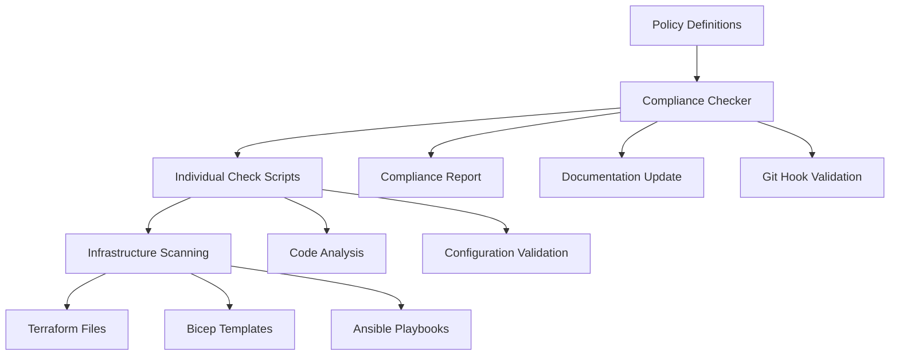

# Compliance Framework

The **gemini-play** project includes a comprehensive policy-as-code compliance framework designed to ensure adherence to industry security, data governance, and infrastructure standards.

## 🎯 Overview

Our compliance framework provides:

- **Automated Policy Checking** - Scripts that validate infrastructure and application code
- **Multi-Framework Support** - SOC 2, ISO 27001, GDPR, CCPA, PCI-DSS compliance
- **Documentation Auto-Update** - Keeps documentation in sync with policy changes
- **Git Integration** - Pre-commit hooks for compliance validation
- **Comprehensive Reporting** - Detailed compliance status reports

## 🏗️ Framework Architecture



## 📁 Directory Structure

```
compliance/
├── policies/                    # Policy definitions as JSON
│   ├── security-policy.json     # Security compliance requirements
│   ├── data-governance-policy.json # Data handling and privacy policies  
│   └── infrastructure-policy.json  # Infrastructure and deployment policies
├── scripts/                     # Automated compliance checking scripts
│   ├── compliance-checker.sh    # Main compliance validation script
│   ├── check-encryption.sh      # Encryption compliance checks
│   ├── check-mfa.sh            # Multi-factor authentication checks
│   ├── check-network-security.sh # Network security validation
│   ├── check-iac-compliance.sh  # Infrastructure as Code validation
│   ├── check-backup-policy.sh   # Backup and recovery checks
│   └── [additional check scripts]
├── templates/                   # Policy and report templates
│   └── policy-template.json     # Template for creating new policies
└── reports/                    # Generated compliance reports
    └── compliance-report-*.json # Timestamped compliance reports
```

## 📋 Policy Categories

### 🔒 Security Policies (SEC)

| Policy ID | Title | Description | Severity |
|-----------|-------|-------------|----------|
| SEC-001 | Data Encryption at Rest | All data must be encrypted using AES-256 | Critical |
| SEC-002 | Multi-Factor Authentication | Privileged access requires MFA | High |
| SEC-003 | Network Segmentation | Proper network isolation and firewall rules | High |

### 📊 Data Governance Policies (DG)

| Policy ID | Title | Description | Severity |
|-----------|-------|-------------|----------|
| DG-001 | Data Classification | Data must be properly classified and labeled | High |
| DG-002 | Data Retention | Automated retention and archival policies | Medium |
| DG-003 | Data Privacy | Personal data protection per GDPR/CCPA | Critical |

### 🏗️ Infrastructure Policies (INF)

| Policy ID | Title | Description | Severity |
|-----------|-------|-------------|----------|
| INF-001 | Infrastructure as Code | All infrastructure deployed via IaC | High |
| INF-002 | Infrastructure Monitoring | Comprehensive logging and alerting | Medium |
| INF-003 | Backup and Recovery | Automated backup procedures | Critical |
| INF-004 | Configuration Management | Standardized configurations | Medium |

## 🚀 Usage Guide

### Running Compliance Checks

```bash
# Run all compliance checks
./compliance/scripts/compliance-checker.sh

# Run specific policy category
./compliance/scripts/compliance-checker.sh --policy security

# Generate compliance report only
./compliance/scripts/compliance-checker.sh --report

# Get help
./compliance/scripts/compliance-checker.sh --help
```

### Sample Output

```
[INFO]  2025-07-20 18:41:25 - Starting compliance validation
[INFO]  2025-07-20 18:41:25 - Parsing policy: security-policy
[INFO]  2025-07-20 18:41:25 - Running check for rule: SEC-001
[ERROR] 2025-07-20 18:41:25 - Rule SEC-001: FAILED
[INFO]  2025-07-20 18:41:25 - Running check for rule: SEC-002
[SUCCESS] 2025-07-20 18:41:25 - Rule SEC-002: PASSED
[INFO]  2025-07-20 18:41:25 - Compliance Summary: 7/9 rules passed (77%)
```

### Understanding Compliance Reports

The framework generates detailed JSON reports:

```json
{
  "report": {
    "timestamp": "2025-07-20T18:41:25Z",
    "summary": {
      "total_rules": 9,
      "passed": 7,
      "failed": 2,
      "compliance_percentage": 77
    },
    "details": {
      "passed_rules": ["SEC-002", "SEC-003", "INF-001"],
      "failed_rules": ["SEC-001", "INF-003"]
    }
  }
}
```

## 🔧 Customizing Policies

### Adding New Policies

1. **Create Policy Definition**:
```bash
cp compliance/templates/policy-template.json compliance/policies/custom-policy.json
```

2. **Edit the Policy**:
```json
{
  "policy": {
    "name": "Custom Security Policy",
    "version": "1.0.0",
    "description": "Custom security requirements",
    "rules": [
      {
        "id": "CUSTOM-001",
        "category": "security",
        "title": "API Security",
        "description": "APIs must use HTTPS and authentication",
        "severity": "high",
        "automated_check": true,
        "script": "scripts/check-api-security.sh"
      }
    ]
  }
}
```

3. **Create Check Script**:
```bash
# Create the validation script
cat > compliance/scripts/check-api-security.sh << 'EOF'
#!/bin/bash
echo "Running API security check..."
# Add your validation logic here
exit 0  # 0 = pass, 1 = fail
EOF

chmod +x compliance/scripts/check-api-security.sh
```

### Modifying Existing Policies

1. Edit the JSON policy file in `compliance/policies/`
2. Update the corresponding check script if needed
3. Test with `./compliance/scripts/compliance-checker.sh`
4. Commit changes to trigger documentation updates

## 🤖 Automation Features

### Git Pre-Commit Hook

The framework includes a pre-commit hook that automatically runs compliance checks:

```bash
# Hook is automatically installed at .git/hooks/pre-commit
# To bypass for emergency commits:
git commit --no-verify -m "Emergency fix"
```

### Documentation Auto-Update

When policies change, the framework automatically updates:
- README.md compliance section
- Last compliance check timestamp
- Policy structure documentation

### CI/CD Integration

Add to your GitHub Actions workflow:

```yaml
- name: Run Compliance Checks
  run: |
    chmod +x compliance/scripts/*.sh
    ./compliance/scripts/compliance-checker.sh
  continue-on-error: true  # Set to false for strict compliance
```

## 📊 Compliance Frameworks Supported

### SOC 2 (Service Organization Control 2)
- **Security**: Access controls, authentication
- **Availability**: System uptime and resilience  
- **Processing Integrity**: Complete and accurate processing
- **Confidentiality**: Information protection
- **Privacy**: Personal information handling

### ISO 27001 (Information Security Management)
- Risk management processes
- Information security controls
- Continuous improvement cycles
- Management system requirements

### GDPR (General Data Protection Regulation)
- Data subject rights
- Privacy by design
- Data protection impact assessments
- Breach notification requirements

### CCPA (California Consumer Privacy Act)
- Consumer privacy rights
- Data disclosure requirements
- Opt-out mechanisms
- Data minimization principles

### PCI-DSS (Payment Card Industry Data Security Standard)
- Cardholder data protection
- Secure payment processing
- Regular security testing
- Access control measures

## 🛠️ Advanced Configuration

### Environment-Specific Policies

```bash
# Set environment variable to control policy strictness
export COMPLIANCE_ENV=production  # strict
export COMPLIANCE_ENV=development # relaxed

./compliance/scripts/compliance-checker.sh
```

### Custom Severity Levels

Policies support four severity levels:
- **Critical**: Must pass for production deployment
- **High**: Should pass, warnings generated
- **Medium**: Best practice recommendations
- **Low**: Informational guidelines

### Exclusions and Overrides

Create `.compliance-ignore` file:
```
# Ignore specific rules for development
SEC-001:development
INF-003:testing

# Global exclusions
DG-002:*
```

## 📈 Monitoring and Metrics

### Compliance Trends

Track compliance over time:
```bash
# Generate trend report
./compliance/scripts/compliance-trend.sh --days 30
```

### Integration with Monitoring Tools

Export metrics to external systems:
```bash
# Export to Prometheus format
./compliance/scripts/compliance-checker.sh --export prometheus

# Export to JSON for ELK stack
./compliance/scripts/compliance-checker.sh --export json
```

## 🚨 Troubleshooting

### Common Issues

**Script permissions**:
```bash
chmod +x compliance/scripts/*.sh
```

**Missing jq dependency**:
```bash
# macOS
brew install jq

# Ubuntu/Debian
sudo apt-get install jq
```

**Policy parsing errors**:
```bash
# Validate JSON syntax
jq . compliance/policies/security-policy.json
```

### Debug Mode

```bash
# Run with verbose output
COMPLIANCE_DEBUG=true ./compliance/scripts/compliance-checker.sh
```

## 🤝 Contributing to Policies

1. Fork the repository
2. Create a feature branch: `git checkout -b add-new-policy`
3. Add your policy and tests
4. Ensure all compliance checks pass
5. Submit a pull request with detailed description

## 📚 Related Documentation

- **[[Security Policies|Security-Policies]]** - Detailed security requirements
- **[[Data Governance|Data-Governance]]** - Data handling policies
- **[[Best Practices|Best-Practices]]** - Recommended compliance patterns
- **[[Troubleshooting|Troubleshooting]]** - Common issues and solutions

---

*For questions about compliance policies, please open an issue or discussion on GitHub.*
