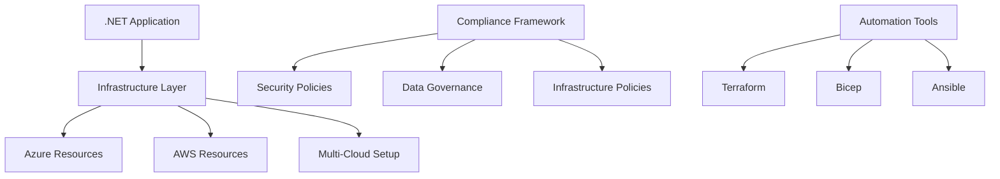

# Welcome to the gemini-play Wiki


## 🌟 Project Overview

**gemini-play** is a comprehensive DevOps project that demonstrates modern Infrastructure as Code (IaC) practices, combining .NET application development with multi-cloud infrastructure automation and compliance frameworks.

### 🎯 Project Goals

- Demonstrate **Infrastructure as Code** best practices
- Implement **multi-cloud** deployment strategies
- Establish **policy-as-code compliance** frameworks
- Showcase **DevOps automation** patterns
- Provide **reusable templates** for enterprise projects

## 🏗️ Architecture Overview



## 📚 Wiki Navigation

### Getting Started
- **[[Quick Start Guide|Quick-Start]]** - Get up and running in 5 minutes
- **[[Installation Guide|Installation]]** - Detailed setup instructions
- **[[Prerequisites|Prerequisites]]** - Required tools and dependencies

### Development
- **[[.NET Application|DotNet-Application]]** - Application development guide
- **[[Local Development|Local-Development]]** - Running locally
- **[[Testing Guide|Testing]]** - Unit and integration testing

### Infrastructure
- **[[Terraform Guide|Terraform]]** - Azure infrastructure with Terraform
- **[[Bicep Templates|Bicep]]** - Azure-native infrastructure
- **[[Ansible Playbooks|Ansible]]** - Configuration management
- **[[Multi-Cloud Strategy|Multi-Cloud]]** - Hybrid cloud deployment

### Compliance & Security
- **[[Compliance Framework|Compliance-Framework]]** - Policy-as-code implementation
- **[[Security Policies|Security-Policies]]** - Security compliance requirements
- **[[Data Governance|Data-Governance]]** - Data handling and privacy policies

### Operations
- **[[Deployment Guide|Deployment]]** - Production deployment strategies
- **[[Monitoring & Observability|Monitoring]]** - Application and infrastructure monitoring
- **[[Troubleshooting|Troubleshooting]]** - Common issues and solutions

### Advanced Topics
- **[[CI/CD Pipeline|CICD]]** - Automated deployment pipelines
- **[[Best Practices|Best-Practices]]** - Recommended patterns and practices
- **[[Contributing Guide|Contributing]]** - How to contribute to the project

## 🚀 Quick Commands

```bash
# Clone the repository
git clone https://github.com/abhishek0412/gemini-play.git
cd gemini-play

# Run the .NET application
dotnet run

# Deploy infrastructure
cd terraform && terraform init && terraform apply

# Run compliance checks
./compliance/scripts/compliance-checker.sh
```

## 📊 Project Statistics

| Component | Files | Lines of Code | Status |
|-----------|-------|---------------|---------|
| .NET App | 2 | ~10 | ✅ Active |
| Terraform | 1 | ~25 | ✅ Active |
| Bicep | 1 | ~22 | ✅ Active |
| Ansible | 6 | ~30 | ⚠️ Basic |
| Compliance | 15+ | ~500+ | ✅ Active |

## 🤝 Contributing

We welcome contributions! Please see our **[[Contributing Guide|Contributing]]** for details on:

- Code style and standards
- Pull request process
- Issue reporting guidelines
- Development workflow

## 📞 Support

- **Issues**: [GitHub Issues](https://github.com/abhishek0412/gemini-play/issues)
- **Discussions**: [GitHub Discussions](https://github.com/abhishek0412/gemini-play/discussions)
- **Wiki**: You're here! 📖

## 🏷️ Tags

`Infrastructure-as-Code` `DevOps` `Azure` `Terraform` `Bicep` `Ansible` `.NET` `Compliance` `Multi-Cloud` `Automation`

---

*Last updated: $(date '+%Y-%m-%d')*
